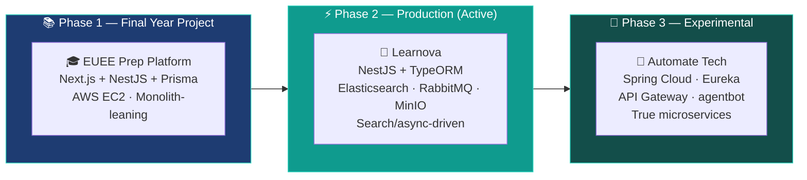

 

 

---

## 🟢 Currently Building

<table>
  <tr>
    <td align="center" width="120">
        
      <b>🚀 Learnova</b>
    </td>
    <td>
      <b>AI-Powered EUEE Prep Platform</b> — Production system at Solanova Technologies.  
      NestJS/TypeORM backend with <b>Elasticsearch</b> for curriculum search, <b>RabbitMQ</b> for async content processing, <b>MinIO</b> for asset storage. Frontend on Vite + React 18 + shadcn/ui + TanStack Query, tested with Vitest + Playwright.  
      
      
      
      
      
    </td>
  </tr>
</table>

---

## 🧭 About Me

<table>
  <tr>
    <td>👤 <b>Name</b></td>
    <td>Ewnetu Tesfaye <i>("Kiyaeh")</i></td>
    <td>📍 <b>Location</b></td>
    <td>Addis Ababa, Ethiopia</td>
  </tr>
  <tr>
    <td>💼 <b>Role</b></td>
    <td>Full-Stack Engineer, Solanova Technologies</td>
    <td>🎓 <b>Education</b></td>
    <td>B.Sc. Computer Science, Samara University</td>
  </tr>
  <tr>
    <td>🛠️ <b>Started Coding</b></td>
    <td>2021, with C++</td>
    <td>🌍 <b>Long-Term Goal</b></td>
    <td>AI/ML development in Ethiopia &amp; Africa</td>
  </tr>
  <tr>
    <td>🔭 <b>Currently On</b></td>
    <td>Learnova — EUEE AI prep platform</td>
    <td>🎯 <b>Interests</b></td>
    <td>Clean arch, distributed systems, fitness, good food</td>
  </tr>
</table>

 

I'm a full-stack engineer who likes solving the same problem more than once — on purpose. Most of my recent work traces one question across three different architectures: *how do you build an EUEE prep platform that scales?* Each answer taught me something the last one couldn't.

Currently deep in **NestJS + Elasticsearch + RabbitMQ** for production, experimenting with **Spring Cloud microservices** on the side, and keeping MERN + React Native roots active through client work.

---

## 🎯 The Arc — One Domain, Three Architectures

*Same domain. Three deliberate architectural philosophies.*
*Monolith-leaning → Search/async-driven → True microservices.*

---

## 🛠️ Tech Stack

### 🔴 Expert

### 🟡 Proficient

### 🟢 Exploring

 

**Also working with:**
 

---

## 📌 Flagship Projects

<table>
  <thead>
    <tr>
      <th align="left">Project</th>
      <th align="left">Description</th>
      <th align="left">Stack</th>
    </tr>
  </thead>
  <tbody>
    <tr>
      <td>
        <b>🚀 Learnova</b> 
        
      </td>
      <td>AI-powered EUEE prep platform. Elasticsearch curriculum search, RabbitMQ async processing, MinIO assets. TanStack Query frontend.</td>
      <td>
        
        
        
        
      </td>
    </tr>
    <tr>
      <td>
        <b>🧪 Automate Tech</b> 
        
      </td>
      <td>Java 21 / Spring Boot 3 multi-module system. Eureka service discovery, API Gateway, isolated agentbot AI module — independently deployable.</td>
      <td>
        
        
        
      </td>
    </tr>
    <tr>
      <td>
        <b>💬 Real-Time Chat</b> 
        
      </td>
      <td>7-service microservices system. Splits message persistence from WebSocket transport for independent scaling. Docker Compose orchestrated.</td>
      <td>
        
        
        
        
      </td>
    </tr>
    <tr>
      <td>
        <b>🐟 Tommy Fish ERP</b> 
        
      </td>
      <td>Production ERP for a Dire Dawa distribution business. Tiered pricing, stock deduction, branch transfers, payroll, full reporting.</td>
      <td>
        
        
        
        
      </td>
    </tr>
    <tr>
      <td>
        <b>🍽️ Multi-Tenant Restaurant</b> 
        
      </td>
      <td>Slug-based multi-tenancy serving multiple restaurant clients from one codebase. 4 role-scoped UIs: Customer, Cashier, Kitchen, Admin.</td>
      <td>
        
        
        
      </td>
    </tr>
    <tr>
      <td>
        <b>🏝️ Afar Tourism Bureau</b> 
        
      </td>
      <td>Government client delivery. MERN CMS + admin dashboard for regional tourism bureau. Deployed on Heroku with AWS S3 media storage.</td>
      <td>
        
        
        
        
      </td>
    </tr>
  </tbody>
</table>

<i>Clone/practice projects intentionally excluded — see repositories tab.</i>

---

## 📊 GitHub Stats

---

## 📈 Activity Graph

---

## 🐍 Contribution Snake

---

## 🔭 What I'm Exploring

<table>
  <tr>
    <td align="right"><b>System Design Patterns</b></td>
    <td>
      
    </td>
  </tr>
  <tr>
    <td align="right"><b>Spring Cloud Depth</b></td>
    <td>
      
    </td>
  </tr>
  <tr>
    <td align="right"><b>Elasticsearch Internals</b></td>
    <td>
      
    </td>
  </tr>
  <tr>
    <td align="right"><b>AI/ML Engineering</b></td>
    <td>
      
    </td>
  </tr>
</table>

---

## 💞️ Let's Collaborate

I'm looking to work on:

---

## 😄 Beyond the Code

Fitness and good food keep the mind as sharp as the code — you'll usually find me either debugging a service mesh or at the gym, rarely anything in between. Always up for a conversation about clean architecture, AI in emerging markets, or the best place to eat in Addis.

---

### 📫 Reach Me

&nbsp;

&nbsp;

&nbsp;

  

<i>"The best architecture is the one that lets you change your mind."</i>

 

