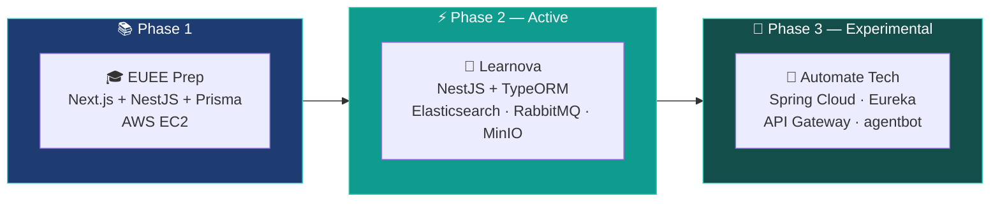

<div align="center">


<br/>

[](mailto:ewnkiya9420@gmail.com)
[](https://www.linkedin.com/in/ewnetu-tesfaye-42a2553a4/)
[](https://ewnetutesfaye.netlify.app/)
[](https://github.com/kiyaeh)


</div>

---

## 🧭 About Me

```yaml
name:     Ewnetu Tesfaye ("Kiyaeh")
location: Addis Ababa, Ethiopia 🇪🇹
building: Learnova — AI-powered EUEE prep platform
stack:    NestJS · Elasticsearch · RabbitMQ · React · Spring Cloud
started:  2021, with C++
goal:     AI/ML engineering in Africa
life:     clean architecture · distributed systems · gym · good food
```

I'm a full-stack engineer who likes solving the same problem more than once — on purpose. Most of my work traces one question across three different architectures: *how do you build a platform that scales?* Each answer taught me something the last one couldn't.

---

## 🎯 The Arc — One Domain, Three Architectures

<div align="center">


```mermaid
flowchart LR
    subgraph P1["📚 Phase 1"]
        A["🎓 EUEE Prep\nNext.js + NestJS + Prisma\nAWS EC2"]
    end
    subgraph P2["⚡ Phase 2 — Active"]
        B["🚀 Learnova\nNestJS + TypeORM\nElasticsearch · RabbitMQ · MinIO"]
    end
    subgraph P3["🔬 Phase 3 — Experimental"]
        C["🧪 Automate Tech\nSpring Cloud · Eureka\nAPI Gateway · agentbot"]
    end
    P1 --> P2 --> P3
    style P1 fill:#1e3c72,stroke:#2DD4BF,color:#fff
    style P2 fill:#0f9b8e,stroke:#2DD4BF,color:#fff
    style P3 fill:#134e4a,stroke:#2DD4BF,color:#fff
```

*Monolith-leaning → Search/async-driven → True microservices*

</div>

---

## 🛠️ Tech Stack

<div align="center">

| | |
|---|---|
| **Expert** |  |
| **Proficient** |  |
| **Exploring** |  |
| **Tooling** |  |

</div>

---

## 📌 Projects

<details open>
<summary><b>🚀 Learnova — AI-Powered EUEE Prep Platform</b> &nbsp; </summary>
<br/>

NestJS/TypeORM backend with **Elasticsearch** for curriculum search, **RabbitMQ** for async processing, **MinIO** for assets. Frontend on Vite + React 18 + shadcn/ui + TanStack Query. Tested via Vitest + Playwright.

`NestJS` `TypeORM` `Elasticsearch` `RabbitMQ` `MinIO` `React` `shadcn/ui` `TanStack Query`

</details>

<details>
<summary><b>🧪 Automate Tech — Spring Cloud Microservices</b> &nbsp; </summary>
<br/>

Java 21 / Spring Boot 3 multi-module system with Eureka service discovery, API Gateway, and an isolated `agentbot` module for AI features — kept independently deployable.

`Java 21` `Spring Boot 3` `Eureka` `Maven` `Next.js 15` `Zustand`

</details>

<details>
<summary><b>💬 Real-Time Chat — 7-Service Microservices</b> &nbsp; </summary>
<br/>

API Gateway routing to 6 independent NestJS services — splits message persistence from WebSocket transport so each scales independently. Docker Compose orchestrated.

`NestJS` `Socket.IO` `PostgreSQL` `Redis` `Docker Compose`

</details>

<details>
<summary><b>🐟 Tommy Fish — Distribution ERP</b> &nbsp; </summary>
<br/>

Production system for a Dire Dawa distribution business. Tiered pricing (retail/wholesale/hotel), stock deduction, branch transfers, payroll, and full reporting.

`NestJS` `Prisma v7` `PostgreSQL` `Redux Toolkit` `Redux-Saga`

</details>

<details>
<summary><b>🍽️ Multi-Tenant Restaurant Platform</b> &nbsp; </summary>
<br/>

Slug-based multi-tenancy serving multiple restaurant clients from one codebase. Four role-scoped UIs: Customer, Cashier, Kitchen, Admin.

`Next.js 16` `React 19` `TypeScript` `Tailwind v4`

</details>

<details>
<summary><b>🏝️ Afar Region Tourism Bureau</b> &nbsp; </summary>
<br/>

Government client delivery. MERN CMS + admin dashboard deployed on Heroku with AWS S3 media storage.

`React` `Redux` `Node.js` `Express` `MongoDB` `JWT`

</details>

---

## 📊 GitHub Stats

<div align="center">


&nbsp;


</div>

<div align="center">


</div>

<div align="center">


</div>

---

## 📈 Activity

<div align="center">


</div>

---

## 🐍 Contributions

<div align="center">


</div>

---

<div align="center">

*From Addis Ababa — building things that matter.*

<br/>

[](mailto:ewnkiya9420@gmail.com)
&nbsp;
[](https://www.linkedin.com/in/ewnetu-tesfaye-42a2553a4/)
&nbsp;
[](https://ewnetutesfaye.netlify.app/)

<br/>


</div>
